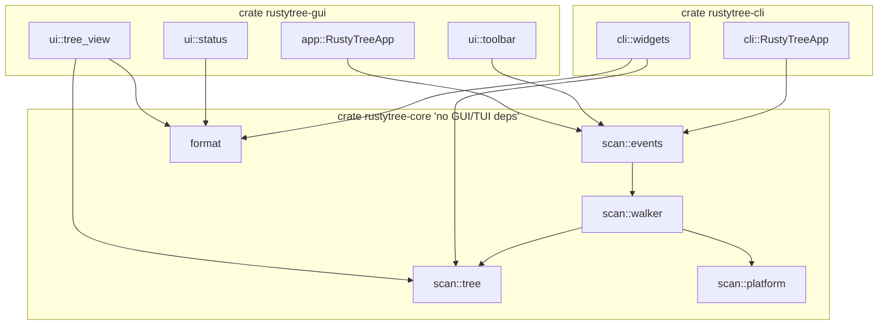
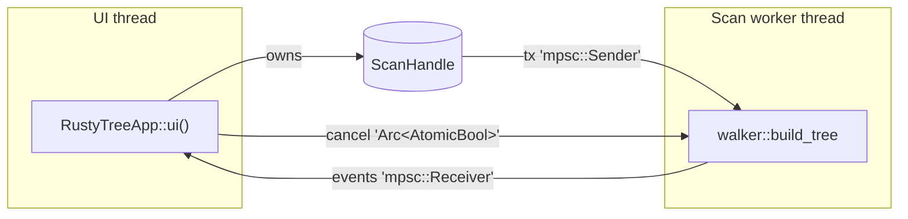
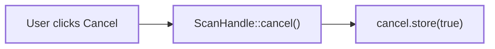
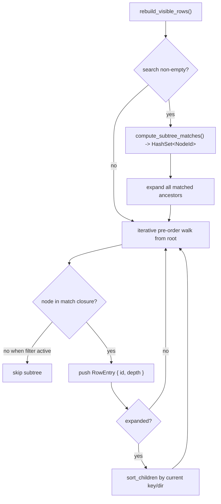

# rustyTree architecture

This document describes how a scan flows through rustyTree, the threading
model, and the cancellation contract. Audience: anyone (human or AI agent)
reading or extending the codebase.

For project status, current backlog, and decisions in flight see the Vikunja
project "rustyTree" (id 66). For coding conventions and the agent
quick-start see [`AGENTS.md`](../AGENTS.md).

## Workspace shape

This is a Cargo workspace. One library crate, two front-end binary crates.
The library crate has zero GUI/TUI dependencies; each front-end depends
only on the rendering stack it actually uses.



The two front-ends are interchangeable from the user's standpoint: same
sort columns, same search semantics, same cancellation, same totals.
Anything visible to both should live in `rustytree-core`. If you find
yourself copying a helper between `rustytree-gui` and `rustytree-cli`, lift
it to core instead.

### Choosing a front-end

| Want | Use |
|------|-----|
| Pointing-and-clicking on a desktop | `cargo run -p rustytree-gui` |
| SSH session, headless server, tmux pane | `cargo run -p rustytree-cli` |
| Integration test, scripting, custom output | depend on `rustytree-core` directly |

## Data flow during a scan

The user clicks **Scan** in the toolbar. From there:

```mermaid
sequenceDiagram
    autonumber
    participant U as User
    participant App as RustyTreeApp 'UI thread'
    participant H as ScanHandle
    participant W as Scan worker 'thread rustytree-scan'
    participant FS as Filesystem

    U->>App: Click Scan
    App->>H: start_scan(path) -> ScanHandle
    H->>W: spawn thread, run walker::build_tree
    loop per directory entry
        W->>FS: read_dir / metadata
        FS-->>W: DirEntry + Metadata
        W->>W: insert Node into Tree, update parent map
        W-->>H: ScanEvent::Progress 'throttled to 50ms'
    end
    W->>W: tree.aggregate(); tree.sort_children_by_size()
    W-->>H: ScanEvent::Done { tree, elapsed }

    loop every UI frame
        App->>H: try_recv()
        H-->>App: ScanEvent::Progress | Done | Cancelled | Error
        App->>App: update Status / store Tree / mark rows_dirty
    end

    Note over App: rows_dirty triggers rebuild_visible_rows on next render
    App->>U: redraw with completed tree
```

The UI thread **never blocks** on filesystem I/O. The worker thread sends
events through a `std::sync::mpsc` channel; the UI polls it from
`eframe::App::ui` each frame and calls
`ctx.request_repaint_after(50ms)` while a scan is running so progress
updates appear without user interaction.

## Threading model



There is exactly **one** worker thread per scan. The thread is named
`rustytree-scan` so it shows up usefully in `top`, `htop`, and panic
backtraces. Internally `jwalk` may use a Rayon thread pool to parallelise
directory reads, but the *yield order* into our walker code is
parent-before-children, which is what `walker::build_tree` requires for its
`PathBuf -> NodeId` parent-lookup map to work in O(1).

## Cancellation contract



- `ScanHandle` owns an `Arc<AtomicBool>` cancel flag. The worker holds a
  clone.
- `walker::build_tree` checks the flag at the top of every iteration over
  `WalkDir::new(...)`. When set it returns `ScanError::Cancelled`, which the
  events module translates into a single `ScanEvent::Cancelled` for the UI.
- `Drop` on `ScanHandle` flips the flag and joins the worker. This means an
  abandoned `RustyTreeApp` (window closed mid-scan) cannot leak a worker
  thread.
- Cancellation is **cooperative**, not pre-emptive: if a single
  `metadata()` call hangs (e.g. on an unresponsive network mount), the
  worker is stuck inside that syscall until it returns. There is no
  deadline / hard-kill mechanism today.

## In-memory tree shape

`scan::tree::Tree` is a flat arena, *not* a recursive `Box<Node>` linked
list:

```rust
pub struct NodeId(u32);

pub struct Tree {
    nodes: Vec<Node>,
    root: Option<NodeId>,
}

pub struct Node {
    pub name: String,
    pub kind: NodeKind,             // Dir | File | Symlink
    pub size_self: u64,
    pub size_total: u64,            // populated by aggregate()
    pub alloc_self: u64,
    pub alloc_total: u64,           // populated by aggregate()
    pub file_count: u64,            // descendants only
    pub dir_count: u64,             // descendants only
    pub mtime: Option<SystemTime>,
    pub owner: Option<String>,
    pub parent: Option<NodeId>,
    pub children: Vec<NodeId>,
}
```

Why an arena rather than `Box<Node>` or a `SlotMap`:

- We never delete nodes during a scan, so the slotmap's generation
  counters would be dead weight.
- A flat `Vec<Node>` keeps cache locality good for the post-order
  aggregate pass and the UI flatten pass.
- `NodeId` is `Copy` and 4 bytes, which is what `egui` row IDs and
  selection state want.

`Tree::aggregate` runs a single iterative post-order traversal that bubbles
`size_total` / `alloc_total` / `file_count` / `dir_count` from leaves to
the root. It is **idempotent**: calling it twice produces the same totals
(verified by `aggregate_is_idempotent` in `tree.rs`).

`Tree::sort_children_by_size` re-orders every node's `children` vector
descending by `size_total` so the canonical default view is "biggest first
at every level". The UI may re-sort children dynamically by a different
key (see below) without mutating the tree.

## UI flatten / sort / search

`UiState` (in `src/app.rs`) holds the cross-frame UI state:

```rust
pub struct UiState {
    expanded: HashSet<NodeId>,
    selected: Option<NodeId>,
    sort_key: SortKey,        // Size | Name | Allocated | FileCount | DirCount | Mtime | Owner
    sort_dir: SortDir,        // Asc | Desc
    search: String,
    visible_rows: Vec<RowEntry>,
    last_progress: Option<ScanProgress>,
    rows_dirty: bool,
}
```

`ui::tree_view::rebuild_visible_rows` is the single source of truth for
the flattened, on-screen row list. It runs whenever `rows_dirty` flips to
`true` (toolbar search box edited, sort header clicked, chevron toggled,
or scan completed).



Rendering uses `egui::ScrollArea::show_rows` so cost is independent of
`tree.len()`; only the rows visible in the viewport produce widgets.

## Adding a new column

1. Append a new variant to `ColumnKind` in `src/app.rs`.
2. Add the column entry to `app::COLUMNS` (label + kind, in display order).
3. If the column corresponds to a sortable field, extend `SortKey` and the
   match in `ui::tree_view::sort_children`.
4. Add a render arm in `ui::tree_view::render_row`'s `match kind`.
5. If the data is platform-specific, surface it through
   `scan::platform::PlatformMetadata` rather than reading from
   `std::fs::Metadata` directly in UI code.
6. Add a test for the sort comparator (or filter behaviour) in
   `ui::tree_view::tests`.

## Adding a new platform

`src/scan/platform.rs` is the only place the scan engine knows about
operating systems. Each platform implements an `extract_impl(&Metadata) ->
PlatformMetadata` private function under its own `cfg`-block:

- `cfg(unix)`: blocks * 512 for allocated bytes, `uzers` cache for owner.
- `cfg(windows)`: logical size fallback, no owner.
- `cfg(not(any(unix, windows)))`: same fallback as Windows; covers WASI /
  redox / unknown targets so `cargo check` stays green.

When adding (e.g.) Windows compressed-file support, only `extract_impl`
needs to change; the `PlatformMetadata` shape stays the same so the UI
keeps working unchanged.

## Future work

Tracked in Vikunja project 66, but a quick taste of what's *not* in MVP:

- Treemap and sunburst visualisations.
- Cross-filesystem boundary detection (`dev_t` compare on unix; volume
  query on Windows) so a scan of `/` doesn't dive into `/proc`, `/sys`,
  network mounts, etc.
- Structured error reporting from the walker (right now per-entry IO
  errors are silently skipped).
- Persisting `UiState` across runs.
- Snapshot / compare ("show me what grew between now and last week").
- Export (CSV / JSON / TreeSize-XML).
